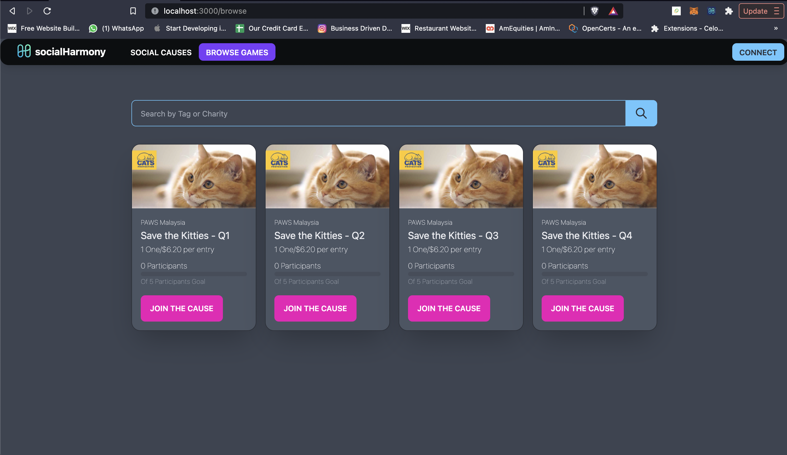
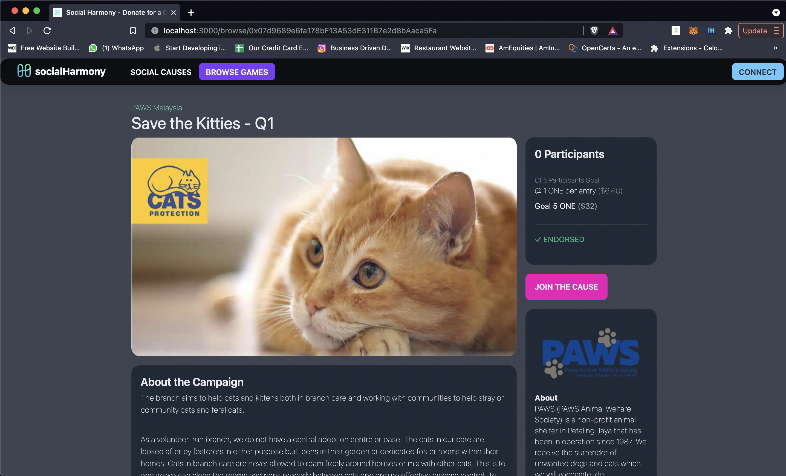
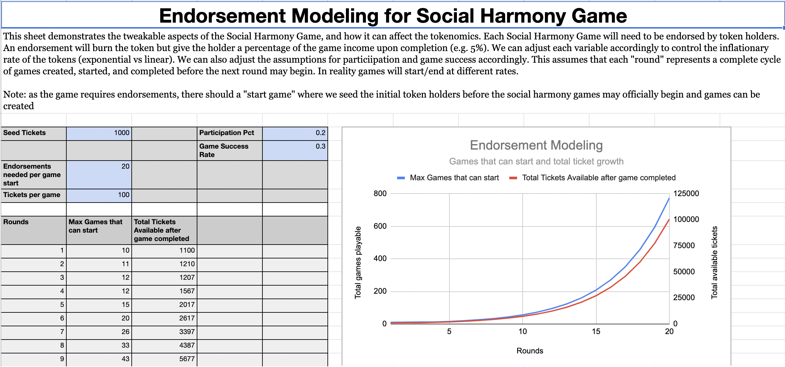

# Social Harmony
This is the mono-repo for the LUV HARMONY Social Game. To start the solution, modify the **truffle/truffle-config.js** to replace the private keys with your funded keys, and **seeder/.env** file (see seeder/.env.sample for required properties).  

The repo is designed to be started with a single make command, and will install most of the dependencies required (node, npm, and truffle are still required).

```
The DAPP is completely reliant on the Harmony One Blockchain. It does not have an underlying backend database.
```
### Landing Page


### Games Page


### Game Page


## Run the demo
```
WARNING: running make will delete the previously deployed token reference (address) and replace with a new instance. The scripts capture the Registry and the SocialGameToken (ERC721)
```
Run the make command in the folder containing the Makefile. This will deploy and seed the environment and run the NextJS ReactJS UI. Note that we are using the test-net so make sure to have some testnet ONE tokens.  

This script will build all the necessary projects, deploy the smart contracts, and seed them with 1 organisation and 4 sample games. 

Once the UI is started, visit http://localhost:3000 to begin.

### Run the tests
A comprehensive test suite is created for the different smart contracts. These can be run using truffle test inside the truffle directory.

```
cd truffle
truffle test
```

### Environment versions:
- node v15.14.0
- npm 7.7.6
- truffle v5.3.10 (pre-installed in global)
- latest solc 
- Linux/Mac OSX (M1 supported but flaky)


# About Social Harmony
This section documents the functionality of the Social Harmony Dapp and built in smart contracts, specifically around the features built for the hackathon.

## Smart Contract Features
### SocialHarmony Registry
- SocialHarmonyRegistry for Organisation Registry (with URI and verification from multi-sig wallets). 

### SocialGameToken
- SocialGameToken ERC721 for Tickets (SocialHarmonyToken, SHMT). The token is also an ERC721 receiver, and users can create a game by depositing an ERC721 token representing details about the game.

- When the game completes, the ERC721 token is refunded to the owner. This allows existing ERC721 tokens to be used as a seed to start a social game (e.g. integrating with [DaVinci](https://davinci.gallery/) or creating a crowd funded game for your cryptokitty). The creator can control the amount of ONE per entry, the number of participants, and the number of endorsers using the extra bytes data in the ERC721 transfer function (safeTransferFrom).

### SocialGame
- SocialGame smart contract holds the game logic to accept deposits in exchange for SHMT tickets. Winners are picked randomly (using VRF and combination of block timestamp and block number for randomness). SocialGame uses two Escrow contracts to hold funds. Games can be cancelled, allowing the players and endorsers to obtain a refund

- Game Endorsement to use the generated SHMT tickets (and token economics study and [model](https://docs.google.com/spreadsheets/d/1QR9s4YUO7YEqH933wQlDOv62hYiRj5q-pvqEHaLnOkk/edit?usp=sharing])). Endorsements allow the owner to earn a one-time fee and share of the Social Game winnings (set at 5% shared among all endorsers). This makes the ERC721 Game Tickets useful beyond a vanity ticket.   

- Game Endorsers will transfer the ERC721 token they receive from a previously completed SocialGame. When the game is complete, they can claim a percentage of the 5% fees.

- First ever Social Game does not require endorsements. This "seed" Social Game can be considered an initial o 

**Endorsement Modeling**   
See [model](https://docs.google.com/spreadsheets/d/1QR9s4YUO7YEqH933wQlDOv62hYiRj5q-pvqEHaLnOkk/edit?usp=sharing]) for more information about the model


### Reporting
A reporting framework is provided in smart contracts to help capture the events as they occur on the blockchain, and allow anyone to transparently view the reports. A simple roll-up mechanism and key/value pair helps to capture data at a macro level and drill down to more finer details.

This framework captures data in real-time and stores the information based on a weekly bucket. An overall report captures all statistics across time.

see truffle/contracts/reports

### Metadata Framework
A metadata framework is provided to allow users to create and customise the data that is shown in the DAPP. Examples can be found in ui/public/samples and is deployed for one organisation and 4 social games. Running make will deploy this sample onto the Harmony One Test network.

We envision storing the metadata on IPFS and a link provided to the ERC721 URI component of the token. This allows us to capture information in a fully decentralised way.


